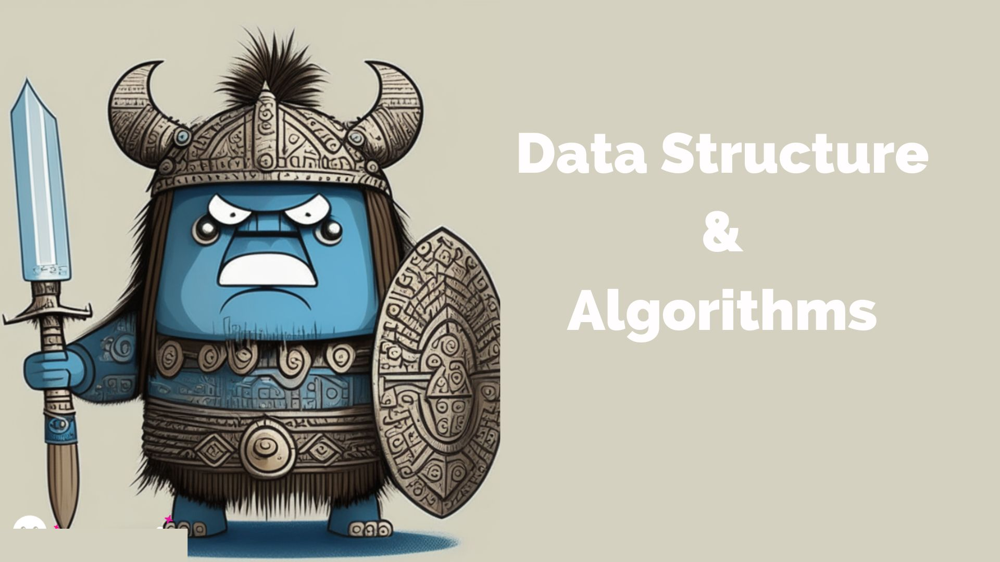

# go-datastructurealgo

Welcome to the go-datastructurealgo project! This repository contains resources related to data structures, algorithms, interview solutions, and LeetCode problem solving.

## datastructurealgo

The `datastructurealgo` directory contains in-depth knowledge and implementation of various data structures and algorithms. It covers topics such as:

- Arrays and Strings
- Linked Lists
- Stacks and Queues
- Trees and Graphs
- Sorting and Searching Algorithms
- Dynamic Programming
- and more!

Feel free to explore the `datastructurealgo` directory to deepen your understanding of different data structures and algorithms.

## interview

The `interview` directory provides solutions and explanations to the questions from the book "Cracking the Coding Interview" by Gayle Laakmann McDowell. It is a valuable resource for interview preparation, as it covers a wide range of interview problems commonly asked in the software industry. Each question is accompanied by a detailed solution, analysis, and explanation.

Take advantage of the `interview` directory to enhance your problem-solving skills and prepare for technical interviews.

## leetcode

The `leetcode` directory contains solutions to various coding problems from the LeetCode platform. LeetCode is a popular website that offers a vast collection of coding challenges that help improve algorithmic thinking and problem-solving abilities.

In the `leetcode` directory, you will find organized folders for different problem categories. Each folder includes solutions to multiple problems, along with explanations and analysis.

Use the `leetcode` directory to practice solving coding problems, explore different algorithms, and enhance your problem-solving capabilities.

## Contributing

Contributions to this project are welcome! If you have any additional data structures, algorithms, interview solutions, or LeetCode problem solutions that you would like to contribute, feel free to create a pull request. Your contributions will help make this repository a valuable resource for the community.

Happy learning and coding!
