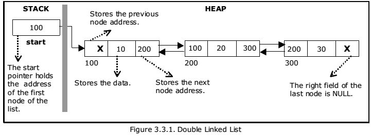

# Doubly Linked List

A doubly linked list is a data structure that consists of a sequence of nodes. Each node contains data and two references (links): one to the previous node and one to the next node. This allows for efficient traversal in both directions.

## Implementation Details

The provided Go code implements a doubly linked list with the following functionalities:

1. `InsertElement(value int)` - Inserts an element at the end of the linked list.
2. `InsertAt(value int, index int)` - Inserts an element at the specified index in the linked list.
3. `DeleteAt(index int)` - Deletes the element at the specified index from the linked list.
4. `DeleteAll()` - Deletes all elements from the linked list.
5. `ReverseLinkedList()` - Reverses the order of elements in the linked list.
6. `SearchElement(value int)` - Searches for an element in the linked list and returns true if found, false otherwise.
7. `MiddleElement()` - Returns the middle element of the linked list.



## Internal Implementation

The doubly linked list is implemented using two structs: `Node` and `DoublyLinkedList`.

### Node

The `Node` struct represents a node in the doubly linked list. It has three fields:
- `value` - the value stored in the node.
- `prev` - a reference to the previous node.
- `next` - a reference to the next node.

### DoublyLinkedList

The `DoublyLinkedList` struct represents the doubly linked list. It has three fields:
- `head` - a reference to the first node in the list.
- `tail` - a reference to the last node in the list.
- `size` - the number of elements in the list.

The doubly linked list provides methods to perform various operations on the list, such as inserting, deleting, reversing, searching, and finding the middle element.

## Usage

To use the doubly linked list, create a new instance of `DoublyLinkedList` using the `NewDoublyLinkedList` function. You can then call the methods provided by the `DoublyLinkedList` struct to perform operations on the list.

Here's an example usage:

```go
package main

import (
	"fmt"
)

// ... (Code omitted for brevity)

func main() {
	dll := NewDoublyLinkedList()

	// Insert elements
	dll.InsertElement(5)
	dll.InsertElement(10)
	dll.InsertElement(3)

	// Insert an element at a specific index
	dll.InsertAt(7, 1)

	// Delete an element at a specific index
	dll.DeleteAt(2)

	// Reverse the doubly linked list
	dll.ReverseLinkedList()

	// Search for an element in the doubly linked list
	fmt.Println("Search Result:", dll.SearchElement(4)) // Output: true
	fmt.Println("Search Result:", dll.SearchElement(7)) // Output: false

	// Get the middle element of the doubly linked list
	middle := dll.MiddleElement()
	fmt.Println("Middle Element:", middle.value) // Output: 10
}
