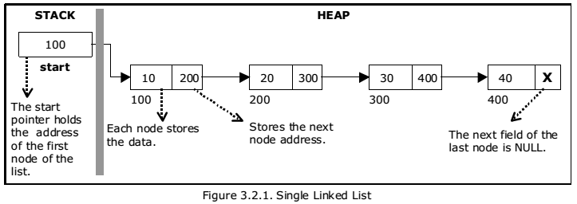

# Singly Linked List

A singly linked list is a data structure that consists of a sequence of nodes. Each node contains data and a reference (link) to the next node in the sequence. It provides an efficient way to store and manipulate a collection of elements.

## Implementation Details

The provided Go code implements a singly linked list with the following functionalities:

1. `InsertElement(value int)` - Inserts an element at the end of the linked list.
2. `InsertAt(value int, index int)` - Inserts an element at the specified index in the linked list.
3. `DeleteAt(index int)` - Deletes the element at the specified index from the linked list.
4. `DeleteAll()` - Deletes all elements from the linked list.
5. `ReverseLinkedList()` - Reverses the order of elements in the linked list.
6. `MergeSorted(other *LinkedList)` - Merges the current linked list with another linked list in sorted order.
7. `MergeSort()` - Sorts the linked list in ascending order using the merge sort algorithm.
8. `SearchElement(value int)` - Searches for an element in the linked list and returns true if found, false otherwise.
9. `MiddleElement()` - Returns the middle element of the linked list.



The `LinkedList` struct consists of a `head` node, which points to the first element of the list, and a `size` field that keeps track of the number of elements in the list. Each node in the linked list has a `value` field to store the element value and a `next` field to reference the next node.

The `InsertElement()` function adds a new element at the end of the list by creating a new node and updating the `next` reference of the last node to point to the new node.

The `InsertAt()` function inserts an element at the specified index by traversing the list to the previous node of the target index, creating a new node, and updating the references to include the new node.

The `DeleteAt()` function removes the element at the specified index by updating the references of the previous and next nodes to bypass the node to be deleted.

The `DeleteAll()` function removes all elements from the list by setting the `head` node to nil and resetting the `size` to 0.

The `ReverseLinkedList()` function reverses the order of elements in the linked list by modifying the `next` references of each node to reverse the direction.

The `MergeSorted()` function merges the current linked list with another linked list in sorted order by comparing the values of the nodes and adjusting the references accordingly.

The `MergeSort()` function uses the merge sort algorithm to sort the linked list in ascending order by recursively dividing the list into smaller sublists, sorting them individually, and merging them back together.

The `SearchElement()` function searches for an element in the linked list by traversing the list and comparing the values until a match is found or the end of the list is reached.

The `MiddleElement()` function finds the middle element of the linked list using the "slow and fast pointer" technique, where the slow pointer moves one step at a time and the fast pointer moves two steps at a time until the fast pointer reaches the end of the list.

## Usage

To use the provided implementation, follow these steps:

1. Create a new instance of the linked list: `ll := NewLinkedList()`
2. Insert elements using `InsertElement()` or `InsertAt()` methods.
3. Perform operations such as deletion, reversal, merging, and searching as required.
4. Access the middle element using `MiddleElement()`.
5. Delete all elements using `DeleteAll()` when no longer needed.

Please refer to the code comments for more details on each function and its usage.

## Example

Here's an example usage of the provided singly linked list implementation:

```go
package main

import (
	"fmt"
)

func main() {
	// Create a new linked list
	ll := NewLinkedList()

	// Insert elements into the linked list
	ll.InsertElement(5)
	ll.InsertElement(10)
	ll.InsertElement(3)

	// Insert an element at a specific index
	ll.InsertAt(7, 1)

	// Delete an element at a specific index
	ll.DeleteAt(2)

	// Reverse the linked list
	ll.ReverseLinkedList()

	// Merge two linked lists in sorted order
	otherList := NewLinkedList()
	otherList.InsertElement(2)
	otherList.InsertElement(8)
	ll.MergeSorted(otherList)

	// Search for an element in the linked list
	fmt.Println("Search Result:", ll.SearchElement(4)) // Output: true
	fmt.Println("Search Result:", ll.SearchElement(7)) // Output: false

	// Get the middle element of the linked list
	middle := ll.MiddleElement()
	fmt.Println("Middle Element:", middle.value) // Output: 10
}
