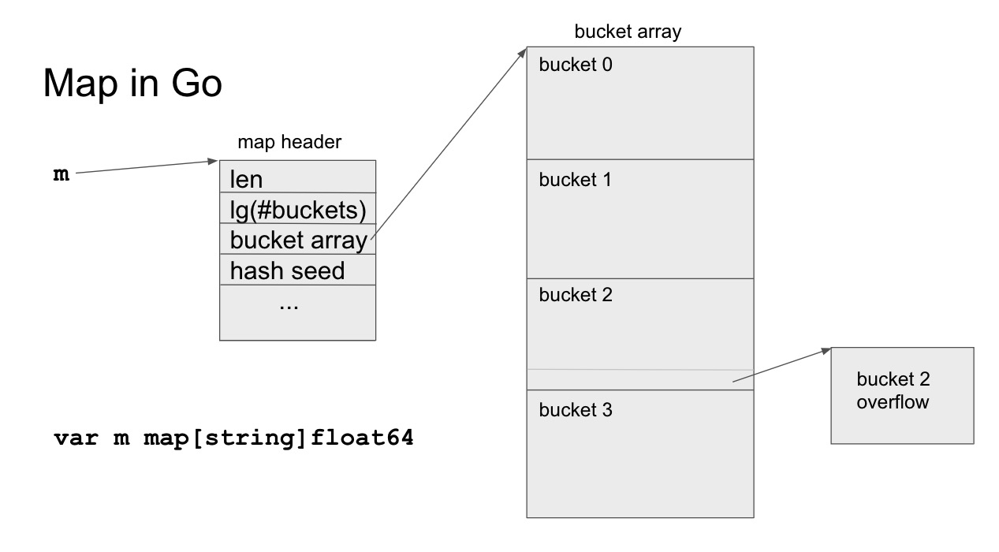

# Go Map Implementation

This is an implementation of a hash table (map) data structure in Go. A hash table is an associative container that maps keys to values, allowing efficient insertion, retrieval, and deletion of key-value pairs.

## Internal Implementation

The implementation uses an array of buckets, where each bucket holds a linked list of key-value pairs. In case of collisions (when two keys map to the same bucket), the new key-value pair is added to the linked list.

The key steps involved in the internal implementation are as follows:

1. **Node:** A `Node` struct is defined to represent a node in the linked list. It holds the key, value, and a pointer to the next node.

2. **Map:** The `Map` struct represents the hash table. It contains an array of buckets (linked lists) and tracks the size of the map.

3. **Hashing:** The `hash` function is used to calculate the hash value for a given key. It utilizes the FNV-1a hash algorithm.

4. **Get:** The `Get` method retrieves the value associated with a given key. It calculates the index of the bucket based on the hash value and traverses the linked list to find the matching key.

5. **Put:** The `Put` method inserts or updates a key-value pair in the map. It calculates the index of the bucket based on the hash value and checks if the key already exists. If the key exists, it updates the value; otherwise, it adds a new node to the linked list.

6. **Delete:** The `Delete` method removes a key-value pair from the map. It calculates the index of the bucket based on the hash value and traverses the linked list to find the key. If found, it removes the node from the linked list.

7. **Values:** The `Values` method returns a slice of all values in the map. It iterates over each bucket, traverses the linked list, and adds each key-value pair to the slice.

8. **Resize:** The `resize` method is called when the number of key-value pairs exceeds 75% of the total capacity. It doubles the number of buckets and rehashes all existing key-value pairs.

