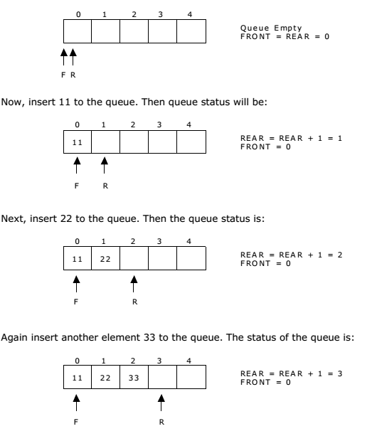
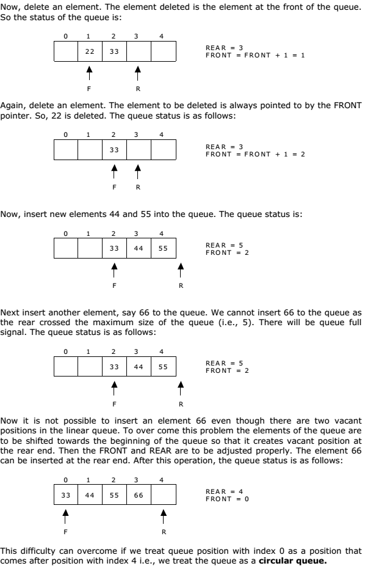

# Queue using Array

A queue is a linear data structure that follows the First-In-First-Out (FIFO) principle. This implementation of a queue uses an array as the underlying data structure.




## Implementation Details

The queue is implemented using a fixed-size array, where elements are added at the rear and removed from the front. The queue keeps track of the front and rear indices, along with the size of the queue.

### Structure

- `Queue`: Represents the queue, containing an array, capacity, front index, rear index, and size counter.

### Approach

1. **Enqueue Operation**: When enqueueing an element into the queue, it is added to the rear of the array. The rear index is updated accordingly, and the size counter is incremented.

2. **Dequeue Operation**: When dequeuing an element from the queue, the element at the front index is removed. The front index is updated accordingly, and the size counter is decremented.

3. **Front Operation**: The front operation returns the element at the front index of the queue.

4. **isEmpty Operation**: Checks if the queue is empty by verifying if the size counter is zero.

5. **isFull Operation**: Checks if the queue is full by verifying if the size counter is equal to the capacity.

### Usage

```go
queue := NewQueue(5)

queue.Enqueue(10)
queue.Enqueue(20)
queue.Enqueue(30)

queue.Print() // Output: 10 20 30

value, err := queue.Dequeue()
if err != nil {
	fmt.Println(err)
} else {
	fmt.Println("Dequeued value:", value) // Output: Dequeued value: 10
}

frontValue, err := queue.Front()
if err != nil {
	fmt.Println(err)
} else {
	fmt.Println("Front value:", frontValue) // Output: Front value: 20
}
