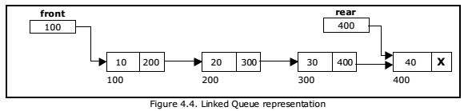

# Queue using Linked List

A queue is a linear data structure that follows the First-In-First-Out (FIFO) principle. This implementation of a queue uses a singly linked list as the underlying data structure.



## Implementation Details

The queue is implemented using a singly linked list, where elements are added at the rear and removed from the front. The queue keeps track of the front and rear pointers, along with the size of the queue.

### Structure

- `Node`: Represents a node in the linked list, containing a value and a pointer to the next node.
- `Queue`: Represents the queue, containing front and rear pointers, along with the size counter.

### Approach

1. **Enqueue Operation**: When enqueueing an element into the queue, a new node is created and added at the rear of the linked list. The rear pointer is updated accordingly, and the size counter is incremented.

2. **Dequeue Operation**: When dequeuing an element from the queue, the element at the front of the linked list is removed. The front pointer is updated accordingly, and the size counter is decremented.

3. **Front Operation**: The front operation returns the element at the front of the queue.

4. **isEmpty Operation**: Checks if the queue is empty by verifying if the size counter is zero.

### Usage

```go
queue := NewQueue()

queue.Enqueue(10)
queue.Enqueue(20)
queue.Enqueue(30)

queue.Print() // Output: 10 20 30

value, err := queue.Dequeue()
if err != nil {
	fmt.Println(err)
} else {
	fmt.Println("Dequeued value:", value) // Output: Dequeued value: 10
}

frontValue, err := queue.Front()
if err != nil {
	fmt.Println(err)
} else {
	fmt.Println("Front value:", frontValue) // Output: Front value: 20
}
