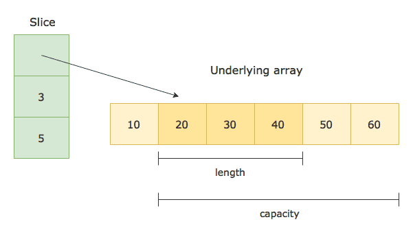

# Slices in Go

A slice is a dynamic, flexible, and variable-length sequence of elements in Go. It is implemented as a lightweight abstraction over an array. Slices provide a convenient way to work with collections of data.



## Internal Implementation

Internally, a slice is implemented as a struct that consists of a pointer to the underlying array, the length of the slice, and the capacity of the slice.

```go
type Slice struct {
	ptr *[]int // Pointer to the underlying slice
	len int    // Length of the slice
	cap int    // Capacity of the slice
}

```

- Pointer to the underlying array: A slice holds a reference to an underlying array that actually stores the elements. The pointer points to the first element of the array.
- Length of the slice: The length represents the number of elements currently in the slice. It can change dynamically as elements are added or removed.
- Capacity of the slice: The capacity is the maximum number of elements that the slice can hold. It is determined by the size of the underlying array.