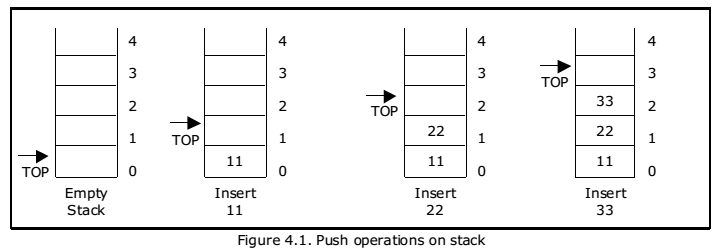
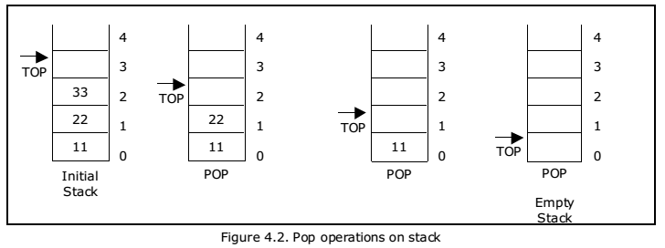

# Stack using Array

A stack is a linear data structure that follows the Last-In-First-Out (LIFO) principle. It can be implemented using an array.

## Implementation Details






The provided Go code implements a stack using an array with the following functionalities:

1. `Push(value int)` - Pushes an element onto the stack.
2. `Pop() (int, error)` - Pops the top element from the stack and returns it. Returns an error if the stack is empty.
3. `Peek() (int, error)` - Returns the top element of the stack without removing it. Returns an error if the stack is empty.
4. `IsEmpty() bool` - Checks if the stack is empty and returns a boolean value.
5. `Size() int` - Returns the number of elements in the stack.

## Internal Implementation

The stack is implemented using a struct `Stack` that has one field:
- `data` - an array that holds the elements of the stack.

The stack provides methods to perform various operations, such as pushing, popping, peeking, checking emptiness, and getting the size.

## Usage

To use the stack, create a new instance of `Stack` using the `NewStack` function. You can then call the methods provided by the `Stack` struct to perform operations on the stack.

Here's an example usage:

```go
package main

import (
	"errors"
	"fmt"
)

// ... (Code omitted for brevity)

func main() {
	stack := NewStack()

	// Push elements onto the stack
	stack.Push(5)
	stack.Push(10)
	stack.Push(3)

	// Pop elements from the stack
	value, _ := stack.Pop()
	fmt.Println("Popped Value:", value) // Output: 3

	// Peek at the top element of the stack
	value, _ = stack.Peek()
	fmt.Println("Top Value:", value) // Output: 10

	// Check if the stack is empty
	fmt.Println("Is Empty:", stack.IsEmpty()) // Output: false

	// Get the size of the stack
	fmt.Println("Size:", stack.Size()) // Output: 2
}
