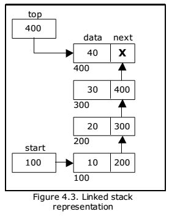

# Stack using Linked List

A stack is a linear data structure that follows the Last-In-First-Out (LIFO) principle. This implementation of a stack uses a linked list as the underlying data structure.

## Implementation Details

The stack is implemented using a singly linked list, where each node contains a value and a reference to the next node. The stack keeps track of the start (first element) and top (last element) of the linked list, allowing for efficient push and pop operations.



### Structure

- `Node`: Represents a node in the linked list, containing a value and a reference to the next node.
- `Stack`: Represents the stack, with pointers to the start and top of the linked list, and a size counter.

### Approach

1. **Push Operation**: When pushing an element onto the stack, a new node is created with the given value. If the stack is empty, the start and top pointers are set to the new node. Otherwise, the new node is added at the top of the stack, and the top pointer is updated.

2. **Pop Operation**: When popping an element from the stack, the top element is removed. If the stack becomes empty after the pop, the start and top pointers are set to nil. Otherwise, the top pointer is moved to the previous node.

3. **Print Operation**: The print operation traverses the linked list from start to end and prints the value of each node.

4. **Peek Operation**: The peek operation returns the value of the top element without removing it.

5. **MidElement Operation**: The midElement operation returns the value of the middle element in the stack. To find the middle element, the stack's size is used to calculate the index of the middle node. The linked list is then traversed until the middle node is reached.

## Usage Example

```go
package main

import (
	"fmt"
)

func main() {
	stack := NewStack()

	stack.Push(10)
	stack.Push(20)
	stack.Push(30)
	stack.Push(40)

	stack.Print() // Output: 10 20 30 40

	value, err := stack.Pop()
	if err != nil {
		fmt.Println(err)
	} else {
		fmt.Println("Popped value:", value) // Output: Popped value: 40
	}

	value, err = stack.Peek()
	if err != nil {
		fmt.Println(err)
	} else {
		fmt.Println("Top value:", value) // Output: Top value: 30
	}

	midValue, err := stack.MidElement()
	if err != nil {
		fmt.Println(err)
	} else {
		fmt.Println("Middle value:", midValue) // Output: Middle value: 20
	}
}
